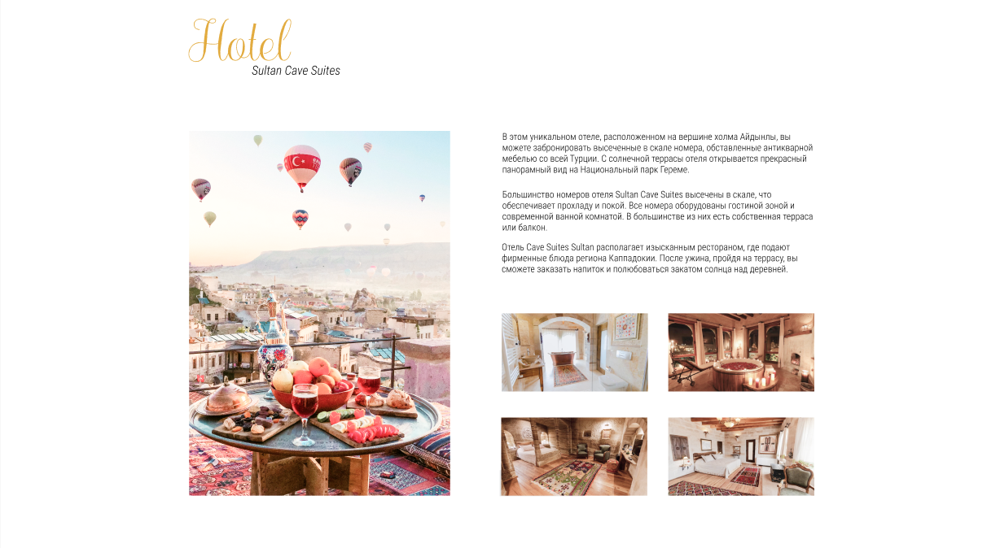

# 1_lab

```
.human 
.head.human__head .head__hair .head__hair--color_black
.body.human__body .body__chest .body__chest--tattooed
.arm.human__arm .arm__finger .arm__finger--ringed
```


<!-- header -->
```
header.header>.header__content.wrapper1200px>.header__navigation-content>nav.header__navigation.nav>ul.header__list>(li.header__item*5>a.navigation__link--active)^^a.header__phone^.header__main-content>h1.header__logo+p.header__logo-subtitle
```


<!-- form -->

```
section.reply.wrapper1200px>.reply__content>h2.visually-hidden+p.reply__title+p.reply__subtitle+p.reply__title+p.subtitle+p.reply__text+form.reply__form.form>fieldset.form__fieldset>(label.form__label>input.form__input)*2+button.form__request^^^img
```


<!-- card -->

```
section.hotel>.hotel__heading>h2.hotel__title+p.hotel__subtitle^.hotel__content>img.hotel__image-main+.hotel__content-right>.hotel__text-content>p.hotel__text*3^.hotel__images>img.hotel__image*4
```


<!-- footer -->
```
footer.footer>.wrapper1200px.footer__content>.footer__baloon>h2.footer__heading+.footer__contacts>a.balloon_contact*2+.balloon_social-networks>(a.balloon_social-network>img)*3^^^^p.footer__text
```

